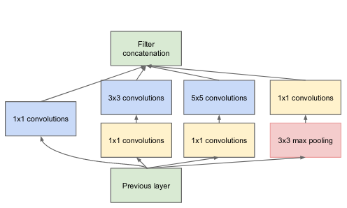
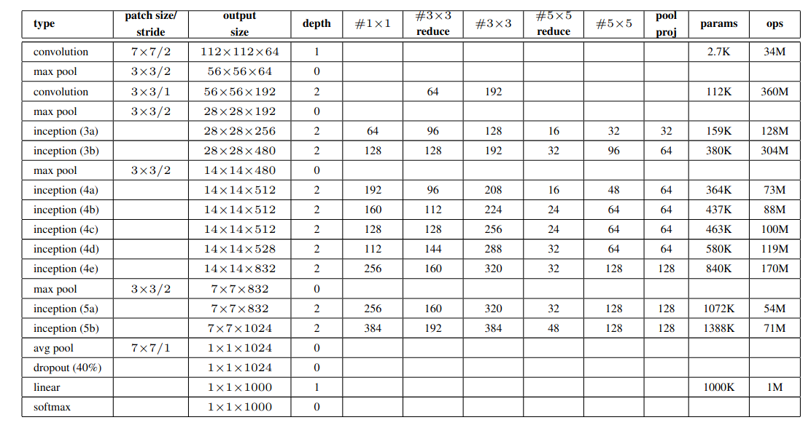
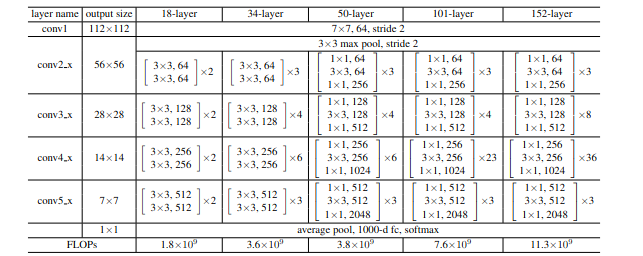
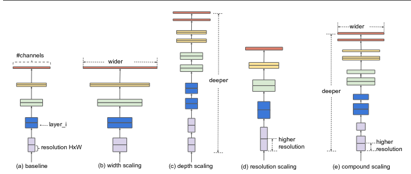

# CNN-architectures-pytorch
pytorch implementation for the most used CNN architecture: <a href=https://github.com/zaghlol94/CNN-architectures-pytorch/blob/main/vgg.py>VGG</a> ,<a href=https://github.com/zaghlol94/CNN-architectures-pytorch/blob/main/lenet.py>leNet</a>
,<a href=https://github.com/zaghlol94/CNN-architectures-pytorch/blob/main/GoogleNet.py>GoogleNet</a>, <a href=https://github.com/zaghlol94/CNN-architectures-pytorch/blob/main/resnet.py>ResNet</a> and 
<a href=https://github.com/zaghlol94/CNN-architectures-pytorch/blob/main/efficientnet.py>EfficientNet</a>
## LeNet
pytorch implementation of LeNet CNN architecture <a href=http://vision.stanford.edu/cs598_spring07/papers/Lecun98.pdf>paper</a>
 
## VGG-net
pytorch implementation of VGG architecture <a href=https://arxiv.org/abs/1409.1556 >paper</a>

## GoogleNet
pytorch implementation of GoogleNet architecture <a href=https://arxiv.org/abs/1409.4842 >paper</a>

## ResNet
pytorch implementation of ResNet architecture <a href = https://arxiv.org/abs/1512.03385>paper</a>

## EfficientNet
pytorch implementation of EfficientNet architecture <a href = https://arxiv.org/abs/1905.11946>paper</a>
