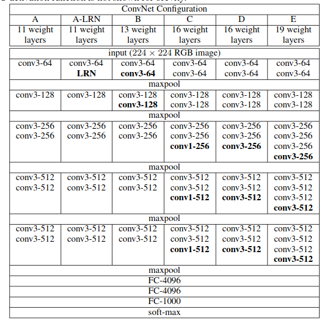

# CNN-architectures-pytorch
## LeNet
pytorch implementation of LeNet CNN architecture <a href=http://vision.stanford.edu/cs598_spring07/papers/Lecun98.pdf>paper</a>
 
## VGG-net
pytorch implementation of VGG architecture <a href=https://arxiv.org/abs/1409.1556 >paper</a>

